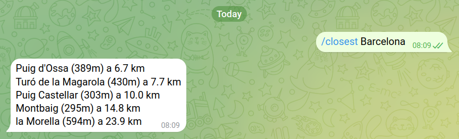

## Dependencies

Install the requirements using

```
pip install -r requirements.txt
```

## Configuration

You need to set up a telegram bot and have the bot token as environment variable. To set up a new bot, use the [BotFather](https://telegram.me/BotFather)
Then, export the required environment variable as :

```
export CIMS_BOT_TOKEN=$your_bot_token
```

## Running

Run the telepot bot as 

```
python app.py
```



